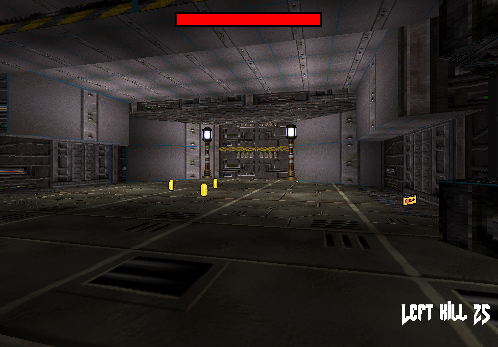
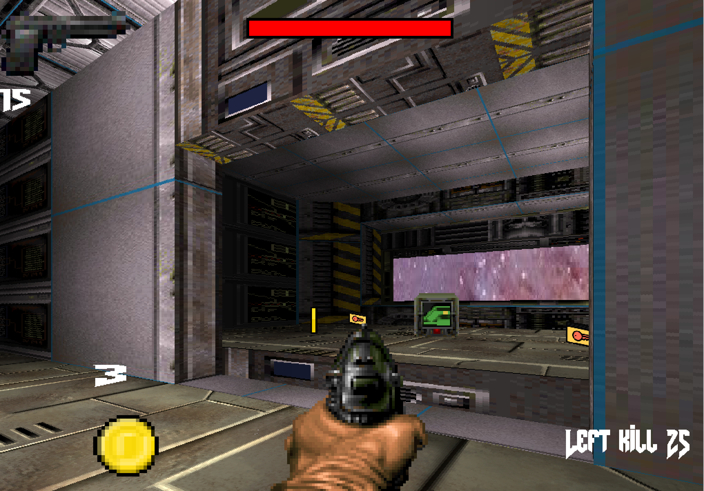
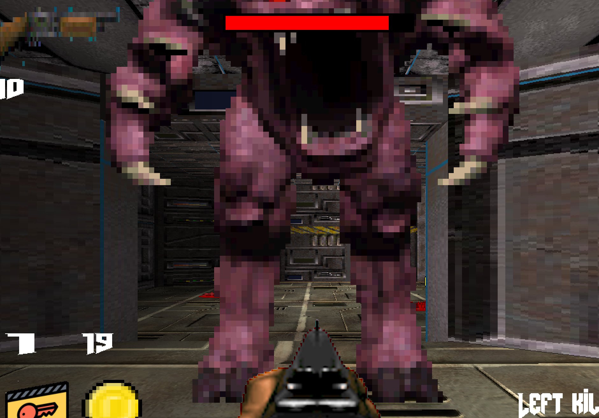
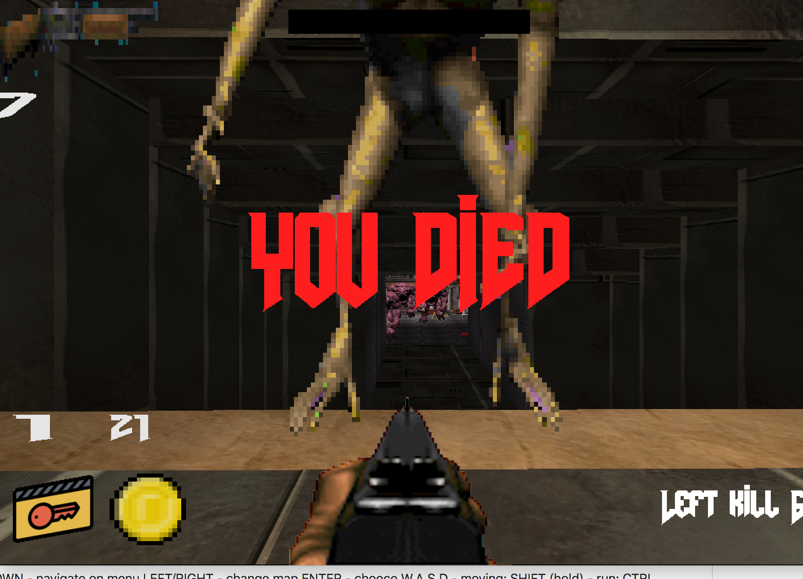

# Doom-Nukem

This project was made by me and my teammates: https://github.com/TimiTeam (Engine co-worker) and https://github.com/mmariashp (Level editor), as a part of 42 study program.

Controls:

UP/DOWN - menu navigation;

LEFT/RIGHT - map selection;

ENTER - confirmation;

W,A,S,D - movement;

SHIFT (hold) - run;

CTRL (hold) - crouch;

E - door interaction;

F - elevator activation;

1,2,3 - weapon slots;

ESCAPE - exit;

BACKSPACE - open/close menu;

LMB - shoot;

# Screenshots

